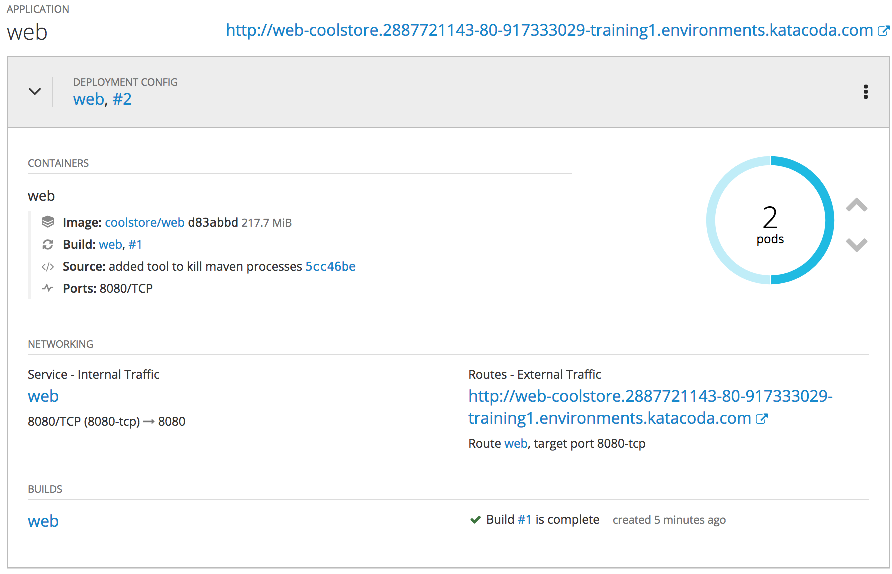

Applications capacity for serving clients is bounded by the amount of computing power 
allocated to them and although it's possible to increase the computing power per instance, 
it's far easier to keep the application instances within reasonable sizes and 
instead add more instances to increase serving capacity. Traditionally, due to 
the stateful nature of most monolithic applications, increasing capacity had been achieved 
via scaling up the application server and the underlying virtual or physical machine by adding 
more cpu and memory (vertical scaling). Cloud-native apps however are stateless and can be 
easily scaled up by spinning up more application instances and load-balancing requests 
between those instances (horizontal scaling).


In previous labs, you learned how to build container images from your application code and 
deploy them on OpenShift. Container images on OpenShift follow the 
[immutable server](https://martinfowler.com/bliki/ImmutableServer.html) pattern which guarantees 
your application instances will always starts from a known well-configured state and makes 
deploying instances a repeatable practice. Immutable server pattern simplifies scaling out 
application instances to starting a new instance which is guaranteed to be identical to the 
existing instances and adding it to the load-balancer.

Now, let's use the `oc scale` command to scale up the Web UI pod in the CoolStore retail 
application to 2 instances. In OpenShift, deployment config is responsible for starting the 
application pods and ensuring the specified number of instances for each application pod 
is running. Therefore the number of pods you want to scale to should be defined on the 
deployment config.

> You can scale pods up and down via the OpenShift Web Console by clicking on the up and 
> down arrows on the right side of each pods blue circle.

First, get list of deployment configs available in the project.

`oc get dc`{{execute}}

And then, scale the `web` deployment config to 2 pods:

`$ oc scale dc/web --replicas=2`{{execute}}

The `--replicas` option specified the number of Web UI pods that should be running. If you look 
at the OpenShift Web Console, you can see a new pod is being started for the Web UI and as soon 
as the health probes pass, it will be automatically added to the load-balancer.

{:width="740px"}

You can verify that the new pod is added to the load balancer by checking the details of the 
Web UI service object:

`$ oc describe svc/web`{{execute}}

`Endpoints` shows the IPs of the 2 pods that the load-balancer is sending traffic to.

```
...
Endpoints:              10.129.0.146:8080,10.129.0.232:8080
...
```

The load-balancer by default, sends the client to the same pod on consequent requests. The 
[load-balancing strategy](https://docs.openshift.com/container-platform/3.5/architecture/core_concepts/routes.html#load-balancing) 
can be specified using an annotation on the route object. Run the following 
to change the load-balancing strategy to round robin: 

```
$ oc annotate route/web haproxy.router.openshift.io/balance=roundrobin
```
