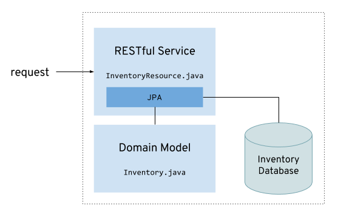

The `inventory-wildfly-swarm` project has the following structure which shows the components of 
the WildFly Swarm project laid out in different subdirectories according to Maven best practices:

```
├── pom.xml            # The Maven project file
└── src
    └── main
        └── java       # The source code to the project
        └── resources  # The static resource files and configurations
```

> WildFly Swarm projects can also be managed using other tools besides Maven, such as
> Gradle, JBoss Forge, or SwarmTool. Refer to 
> [WildFly Swarm Documentation](https://wildfly-swarm.gitbooks.io/wildfly-swarm-users-guide/getting-started/tooling/forge-addon.html) 
> for more details.

This is a minimal Java EE project with support for JAX-RS for building RESTful services and JPA for connecting
to a database. [JAX-RS](https://docs.oracle.com/javaee/7/tutorial/jaxrs.htm) is one of Java EE specifications that uses Java programming language annotations to simplify the development of RESTful web services. [Java Persistence API (JPA)](https://docs.oracle.com/javaee/7/tutorial/partpersist.htm) is another Java EE specification that provides Java developers with an object/relational mapping facility for managing relational data in Java applications.

This project currently contains no code other than the main class for exposing a single 
RESTful application defined in `InventoryApplication.java`. 

Examine `InventoryApplication.java`

`cat src/main/java/com/redhat/cloudnative/inventory/InventoryApplication.java`{{execute}}

You would see the following code:

```java
package com.redhat.cloudnative.inventory;

import javax.ws.rs.ApplicationPath;
import javax.ws.rs.core.Application;

@ApplicationPath("/")
public class InventoryApplication extends Application {
}
```

Run the Maven build to make sure the skeleton project builds successfully. You should get a `BUILD SUCCESS` message 
in the logs, otherwise the build has failed.

> Make sure to run the `package` Maven goal and not `install`. The latter would 
> download a lot more dependencies and do things you don't need yet!

`mvn package`{{execute}}

You should see a `BUILD SUCCESS` in the logs.

```
[INFO] ``````````````````````````````````````````````````````
[INFO] BUILD SUCCESS
[INFO] ``````````````````````````````````````````````````````
[INFO] Total time: 10.757 s
[INFO] Finished at: 2017-07-24T10:49:54+07:00
[INFO] Final Memory: 44M/481M
[INFO] ``````````````````````````````````````````````````````
```

Once built, the resulting *jar* is located in the `target/` directory:

`ls target/*.jar`{{execute}}

The list jar archive, `target/inventory-1.0-SNAPSHOT-swarm.jar`, is an uber-jar with 
all the dependencies required packaged in the *jar* to enable running the 
application with `java -jar`. WildFly Swarm also creates a *war* packaging as a standard Java EE web app 
that could be deployed to any Java EE app server (for example, JBoss EAP, or its upstream WildFly project). 

Now let's write some code and create a domain model and a RESTful endpoint to create the Inventory service:



